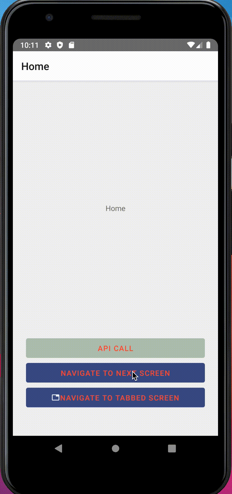
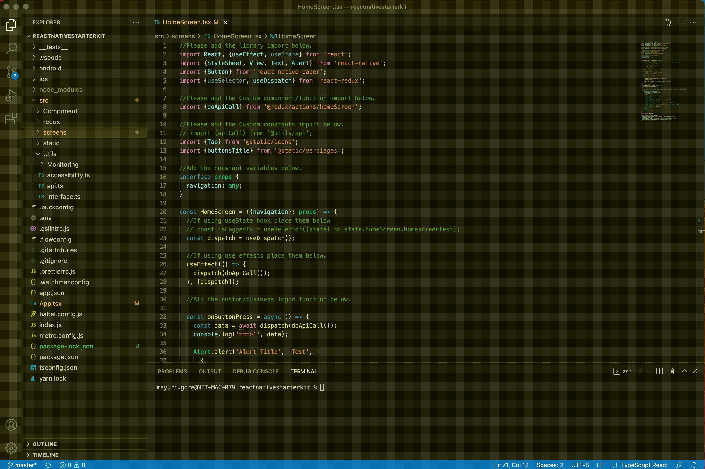

README File
# **React Native Starter Kit** 
This starter kit is designed to get you up and running with a complete React Native (RN) project in the shortest possible time. 
<!--  -->

  

This kit has been created for **quick to start** development work. So, all the configurations added in the kit provide the template for the developer instead of building the project from scratch, ultimately boosting initial implementation time for the project.

 **Content**

- Screens
- Key Highlights
- Get Started
- Technology
- Repository
- Future Plans

 **Screens**

<!--  -->

  

 **Key Highlights**

1. React Native exception handler

     Previously, an application would directly close without handling or explaining the error. Now, with the exception handler, the users will be able to view the nature and description of the error on the fallback screen.

    The fallback screen is a single all-purpose view of the application. In most cases, wrapping code in try-catch is the most preferred approach, but that may not be an option for JavaScript XML (JSX), as it dips the performance of the code. Therefore, the exception handler does not show the fallback screen if the error occurs in JSX.

2. Error Boundary
- The exception handler takes care of syntax errors, but when the error occurs in JSX, the exception handler is insufficient.
- To handle the JSX rendering failure, we added an Error Boundary. So, in case if there is an error in the JSX, the application will display the same screen that the exception handler would display.

**Note:** 
For complete understanding, look into the [react-native exception handler official page](https://www.npmjs.com/package/react-native-exception-handler).

3. Babel module resolver

    This library helps you eliminate all the dot (.) notation of accessing a component or utility. Just configure and use it. The plugin takes care of the rest.

4. TypeScript

    TypeScript adds additional syntax to JavaScript to support a tighter integration with your editor. It finds errors early in your editor.

5. VScode

- We also have a snippet configured with this kit for VScode. You don't need to write the basic function from scratch all the time. Just use the key "**rn\_comp\_func**", and the VScode displays it as an auto-suggestion halfway through typing, making component creation quicker.
- Currently, we have provided "Creating functional component" with this feature.

**🚀 Getting Started**

**System Requirement**

Set up a React Native environment in advance.

**Note**:

Follow the React Native official page for setting up the environment.

**Installation**

1. Clone the project
1. Install **npm** (To manage dependencies of various server-side dependencies)
1. Install **cd iOS/&& pod** (To install all the dependencies for iOS configured in pods)

**Note:**
In case of an error, try the command given below to remove all the dependencies and reinstall everything, including the Android and iOS folders.
rm package-lock.json  && rm -R node\_modules && npm install && npx jetify && cd ios/ && pod deintegrate && pod cache clean --all && pod install && cd .. && cd android/ && ./gradlew clean && cd ..

**Usage**

After completing the above steps and changing the app bundle ID, you can start the project creation process.

**Add directory to Babel module resolver (Optional)**

- Add your directory path in the Babel.config.js file inside the alias section.
- Add your directory path in the Tsconfig.json file inside the paths section.

**Note:**

Follow the existing directory path pattern in the respective files. However, you might get an error in the metro bundler (saying unable to import), for which you will need to restart the metro bundler again.

**Technology**

Technologies used in the React Native starter kit:

1. [React Native community/async storage:](https://reactnative.dev/docs/asyncstorage)

    It is an asynchronous, unencrypted, persistent, key-value storage system for React Native.

2. [React Native firebase/app:](https://rnfirebase.io/)

    React Native firebase is the officially recommended collection of packages that brings React Native support for all firebase services on both Android and iOS apps.

3. [React Native firebase/crashlytics:](https://rnfirebase.io/crashlytics/usage)

    React Native firebase/crashlytics helps you collect analytics and details about crashes and errors in the app. It does this through three aspects:

**Logs**: Log events in your app that are sent with the crash report for context, if your app crashes.

**Crash reports**: Every crash is automatically turned into a crash report and sent.

**Stack traces**: Even when an error is identified and your app recovers, the JavaScript stack trace can still be sent.

**Note:**

React Native firebase supports crashlytics NDK reporting, which is enabled by default. This allows crashlytics to capture crashes originating from the Yoga layout engine used by React Native. You can disable crashlytics NDK in your firebase. json config.

4. [React Native firebase/performance:](https://rnfirebase.io/reference/perf)

- React Native firebase/performance monitoring allows you to gain insights into key performance characteristics within your React Native application. It provides a simple API to track custom trace and HTTP request metrics.
- It reviews and analyzes the data in the firebase console. Performance monitoring helps you understand where and when your app's performance can be improved so that you can use that information to fix performance issues.

5. [React Native masked view:](https://reactnavigation.org/docs/5.x/getting-started/)

    It provides a masked view that only displays the pixels overlapping with the view rendered in its mask element.

**Note:** 

Most React Native projects use @react-native-community/masked-view or @react-native-masked-view/masked-view. But a React Navigation v5.x user can only use @react-native-community/masked-view.

6. [React navigation/bottom tabs:](https://reactnavigation.org/docs/bottom-tab-navigator/)

    A simple tab bar on the bottom of the screen lets you switch between different routes. 

<!--    -->

  
  

7. [React navigation/drawer:](https://reactnavigation.org/docs/drawer-based-navigation/)

    
**React Native Drawer Navigation** is a UI panel that displays the app's navigation menu. By default, it is hidden when not in use but appears when the user swipes a finger from the edge of the screen or touches the top of the drawer icon added at the app bar.

8. [React navigation/native:](https://reactnavigation.org/docs/getting-started/)

    React Native is a JavaScript framework for building cross-platform apps.

9. [React navigation stack:](https://reactnavigation.org/docs/stack-navigator/)

- It provides a way for your app to transition between screens and manage navigation history.
- If your app uses only one stack navigator, it is conceptually similar to how a web browser handles navigation state - your app pushes and pops items from the navigation stack as users interact with it, resulting in the user seeing different screens.

10. [Types/lodash:](https://www.npmjs.com/package/@types/lodash)

    This package contains type definitions for Lodash.

11. [Types/react-native vector icons](https://www.npmjs.com/package/react-native-vector-icons):

- React Native vector icons are the most well-known NPM GitHub library, mainly due to the logos, buttons, navigation, and tab bars.
- These vector icons integrate style, which can be extended into a project. In addition, they are attractive in presentations and convey more information than plain text. 

**Note:** 

The icon colour, icon size and multiple styles can be changed, as icons are entirely customizable. 

- Some icons are displayed in the figure below.

<!--  -->

12. [Axios:](https://axios-http.com/docs/intro)

- Axios is a library that creates HTTP requests that are present externally. React applications may sometimes need to get data from an external source, which is difficult to fetch. Axios makes it easy to retrieve such hard-to-find data and adds it to the application whenever the requirement arises.
- Additionally, react Axios is very easy to modify and is relatively lightweight. It also works great with many other frameworks present today. The main purpose of using Axios is to get support for request and response interception, convert data into [JSON format](https://www.javatpoint.com/json-tutorial) and transform it. It also helps you protect XSRF forgery by default while you request cross-site access.
- Axios is promise-based, giving you the ability to take advantage of JavaScript's async and await more readable asynchronous code.
- It cancels or intercepts requests and protects the application through an inbuilt client-side anti-forgery feature across cross-site requests.

13. [Lodash:](https://lodash.com/docs/)

- Lodash is a JavaScript library that provides utility functions for common programming tasks. It uses a functional programming paradigm and significant upgrades to library like Underscore.js.
- It helps programmers write more concise and easier to maintain JavaScript code. It contains tools to simplify programming with strings, numbers, arrays, functions, and objects.
- By convention, the Lodash module is mapped to the underscore character.

14. [React:](https://reactjs.org/)

- React is a [free and open-source](https://en.wikipedia.org/wiki/Free_and_open-source_software) [front-end](https://en.wikipedia.org/wiki/Front_end_and_back_end) [JavaScript library](https://en.wikipedia.org/wiki/JavaScript_library) for building [user interfaces](https://en.wikipedia.org/wiki/User_interfaces) or UI components.
- It can be used as a base in developing [single-page](https://en.wikipedia.org/wiki/Single-page_application) or mobile applications. However, it is only concerned with state management and rendering it to the Document Object Model ([DOM](https://en.wikipedia.org/wiki/Document_Object_Model)). It means that creating React applications usually requires additional libraries for routing and certain client-side functionalities.

15. [React Native:](https://reactnative.dev/)

- React Native helps make the development work more accessible and allows the developers to focus on the core app features in every new release. 
- React Native takes charge of view controllers and programmatically generates native views using JavaScript. This means that you can have all the speed and power of a native application with the ease of development that comes with React.

16. [React Native config:](https://www.npmjs.com/package/react-native-config)

    The React Native config module lets you expose config variables to your JavaScript code in React Native, supporting iOS, Android, and Windows.

17. [React Native exception handler:](https://www.npmjs.com/package/react-native-exception-handler)

    A React Native module lets you register a global error handler to capture fatal/non-fatal uncaught exceptions. The module helps prevent abrupt crashing of React Native Apps without a graceful message to the user.

18. [React Native gesture handler:](https://www.npmjs.com/package/react-native-gesture-handler)

- It provides native-driven gesture management APIs for building the best possible touch-based experiences in React Native.
- With this library, gestures are no longer controlled by the JS responder system but are recognized and tracked in the UI thread. As a result, it makes touch interactions and gesture tracking not only smooth but also dependable and deterministic.

19. [React Native paper:](https://reactnativepaper.com/)

    A UI library that provides all the UI components and features on the UI front. We use this particular library to start because the "React Native community" develops it.

**Note:**

To keep things easy, we have kept it loosely coupled with the template so that any team who intend to use this package can change the UI library as per their need.

20. [React Native reanimated:](https://www.npmjs.com/package/react-native-reanimated)

    It provides a more comprehensive, low-level abstraction for the animated library API to be built on top of, allowing greater flexibility, especially for gesture-based interactions.

21. [React Native safe area context:](https://www.npmjs.com/package/react-native-safe-area-context)

    It provides a **flexible API for accessing the information on the device safe area inset**. This allows you to position your content appropriately around notches, status bars, home indicators, and other such device and operating system interface elements.

22. [React Native screens:](https://www.npmjs.com/package/react-native-screens)

    It aims to expose native navigation container components to React Native. It is not designed to be used as a standalone library but rather as a dependency of a [full-featured navigation library](https://github.com/react-navigation/react-navigation).

23. [React Native splash screen:](https://www.npmjs.com/package/react-native-splash-screen)

    This library deals with all work-related splash screens. 

**Note:**

The library is configured, and because there are various ways to build the splash screen, we have kept it open to do it the way you want.

24. [React Native vector icons](https://oblador.github.io/react-native-vector-icons/):

    It allows the app to show non-image and resizable icons. They are easy to use and are very similar to font styling.

25. [React redux:](https://react-redux.js.org/introduction/getting-started)

    It is a state management library that allows the creation of a centralized place for data within an application which any component can assess without passing in as props.

26. [Redux:](https://redux.js.org/introduction/getting-started)

- As the requirements for JavaScript single-page applications have become increasingly complicated, our code must manage more states than ever before. In addition, the UI state is also increasingly complex, as we need to manage the active routes, selected tab, spinner, and pagination control preferences.
- Redux is a predictable state container for JavaScript apps. It helps you write applications that behave consistently, run in different environments (client, server, and native), and are easy to test.
- Redux attempts to make state mutations predictable by imposing certain restrictions on how and when updates can happen. These restrictions are reflected in the following manner:
- The state of the whole application is stored in an object tree within a single store.
- The only way to mutate the state is by triggering an action or an object describing what happened.
- To specify how actions transform the state tree, pure reducers are required.

27. [Redux persist:](https://www.npmjs.com/package/redux-persist)

    It is a library that allows saving a Redux store in the local storage of an application.

28. [Redux Thunk:](https://redux.js.org/usage/writing-logic-thunks)

- It's a logical concept in programming where you deal with a function that is primarily used to delay the calculation or evaluation of any operation.
- Redux Thunk acts as a middleware that returns you a function instead of an object while calling action creators. First, the returned function receives the dispatch method from the store. Then later, it is used to dispatch synchronously inside the function's body once the asynchronous actions are completed.

**Repository**

1. <https://reactnative.dev/docs/asyncstorage>
1. <https://rnfirebase.io/>
1. <https://rnfirebase.io/crashlytics/usage>
1. <https://rnfirebase.io/reference/perf>
1. <https://reactnavigation.org/docs/5.x/getting-started/>  ,  <https://npm.io/package/@react-native-community/masked-view>
1. <https://reactnavigation.org/docs/drawer-based-navigation/>
1. <https://reactnavigation.org/docs/bottom-tab-navigator/>
1. <https://reactnavigation.org/docs/getting-started/>
1. <https://reactnavigation.org/docs/stack-navigator/>
1. <https://lodash.com/docs/>
1. <https://www.npmjs.com/package/@types/lodash>
1. <https://www.npmjs.com/package/react-native-vector-icons> , <https://oblador.github.io/react-native-vector-icons/>
1. <https://axios-http.com/docs/intro>
1. <https://reactjs.org/>
1. <https://reactnative.dev/>
1. <https://www.npmjs.com/package/react-native-config>
1. <https://www.npmjs.com/package/react-native-exception-handler>
1. <https://www.npmjs.com/package/react-native-gesture-handler> ,  <https://reactnavigation.org/docs/5.x/getting-started/>
1. <https://reactnativepaper.com/>
1. <https://www.npmjs.com/package/react-native-reanimated> , <https://reactnavigation.org/docs/5.x/getting-started/>
1. <https://www.npmjs.com/package/react-native-safe-area-context> , <https://reactnavigation.org/docs/handling-safe-area/>
1. <https://www.npmjs.com/package/react-native-screens>
1. <https://www.npmjs.com/package/react-native-splash-screen>
1. <https://react-redux.js.org/introduction/getting-started> , <https://redux.js.org/tutorials/fundamentals/part-5-ui-react>
1. <https://redux.js.org/introduction/getting-started>
1. <https://www.npmjs.com/package/redux-persist> , <https://react-redux-firebase.com/docs/integrations/redux-persist.html>
1. <https://www.npmjs.com/package/redux-thunk> , <https://redux.js.org/usage/writing-logic-thunks>

**Future Plans**

We intend to add more ways to manage the configuration based on the environment. E.g., using prod, QA, or dev and using different based URLs for the same.

We intend to introduce a way to change the package bundle ID directly with just one cmd.
